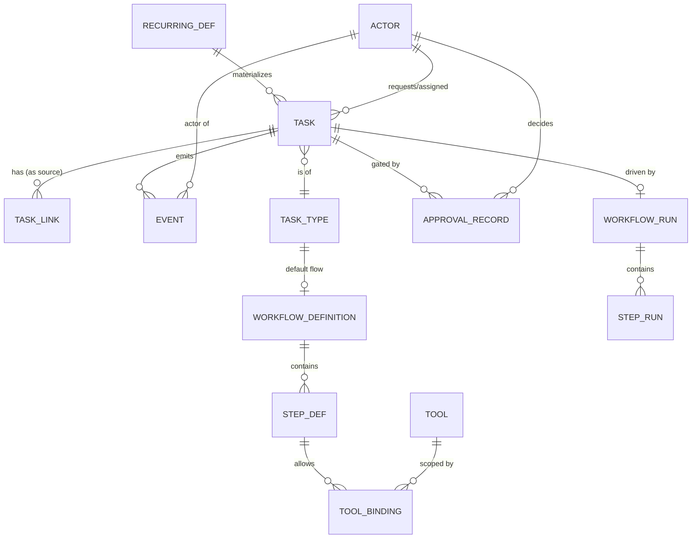
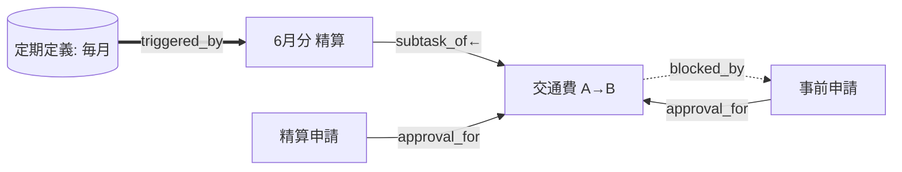

# 02. ドメインモデル / データ構造

> **English summary**: The conceptual data model. Core aggregate is **Task**
> (a durable, linkable, stateful intent). Tasks carry a **Workflow Run**, accumulate
> a structured **Context**, and emit an append-only **Event** ledger. **Task Links**
> form a typed graph (subtasks, blocks, triggered-by, approval-for). **Approval
> Records** capture gated decisions; **Recurring Task Definitions** materialize task
> instances over intervals. Schemas below are conceptual and storage-agnostic.

本ドキュメントは、特定の DB / 言語に依存しない**概念モデル**を定義します。フィールドは
「意味」を示すものであり、型や正規化は実装段階で決めます。図は Mermaid（参考表現）です。

## 1. 全体像（エンティティ関係）

中心は **TASK** です。タスクは型（TASK_TYPE）を持ち、その型が既定のワークフロー定義を指し、
タスク生成時にワークフロー実行（WORKFLOW_RUN）が束ねられます。

## 2. Task（タスク）— 中核アグリゲート

ひとつの業務上の意図を表す永続エンティティ。

| フィールド | 意味 | 備考 |
|-----------|------|------|
| `id` | 一意識別子 | URL 化される。「石」の住所。 |
| `title` | 短い人間可読の題名 | 例：「6月分 交通費の精算」 |
| `intent` | 自然言語の意図 | 起票時の依頼内容。エージェントの出発点。 |
| `type` | タスク種別への参照 | → TASK_TYPE。既定フローを決める。 |
| `status` | 現在の状態 | 状態機械の現在値（[03](./03-workflow-engine.md)）。 |
| `requester` | 依頼者（人/エージェント） | → ACTOR |
| `assignee` | 担当者（人/エージェント） | → ACTOR。実行主体。人にもエージェントにもなりうる。 |
| `parent_id` | 親タスク | サブタスク関係（NULL 可）。 |
| `workflow_run_id` | 駆動中の実行 | → WORKFLOW_RUN（NULL 可：フロー未開始）。 |
| `context` | 構造化ペイロード | 金額・経路・領収書有無 等。フロー進行で蓄積。 |
| `priority` / `due_at` | 優先度 / 期限 | 任意。 |
| `created_at` / `updated_at` | 監査用時刻 | |
| `origin` | 生成元 | 手動 / 定期定義 / 他タスクからのトリガ。 |

**設計判断：`context` は型ごとにスキーマを持つ。** 例えば経費精算型なら
`{ amount, currency, route_from, route_to, receipt_required, receipt_attached }`。
型なし自由 JSON ではなく、型ごとの**契約**として扱うことで、ツールやゲートが安全に参照できる。

## 3. TaskType（タスク種別）とテンプレート

| フィールド | 意味 |
|-----------|------|
| `key` | 種別キー（例：`expense.transport`） |
| `display_name` | 表示名 |
| `context_schema` | この型の `context` が満たすべきスキーマ |
| `default_workflow` | 既定のワークフロー定義 → WORKFLOW_DEFINITION |
| `required_capabilities` | この型を扱うのに最低限必要なケイパビリティ（任意） |

タスク種別は「経費精算」「サムネ更新」「外部連絡」などの**業務の型**。新しい業務を増やすとは、
新しい TaskType ＋ WorkflowDefinition ＋必要なら新しい Tool を足すこと。

## 4. TaskLink（タスクリンク）— 型つきグラフ

タスク同士は型つきの有向辺で結ばれ、グラフを成します。

| `link_type` | 意味 | 例 |
|-------------|------|----|
| `subtask_of` | 親子分解 | 「6月精算」←「交通費」「会議費」 |
| `blocks` / `blocked_by` | 進行の依存 | 「精算」は「事前承認」に blocked_by |
| `relates_to` | 緩い関連 | 同じイベントに関する複数タスク |
| `triggered_by` | 生成の由来 | 定期定義や別タスクが起票した |
| `approval_for` | 承認の対象 | 承認タスク → 対象タスク |
| `supersedes` | 置換 | 再申請が旧申請を置き換える |

**設計判断：リンクは辺として独立エンティティにする**（タスク内の配列に埋めない）。
理由：双方向の照会、辺自体のメタデータ（作成者・時刻）、監査、グラフ走査が必要になるため。

## 5. WorkflowDefinition / StepDef（ワークフロー定義）

再利用可能な処理の流れ。詳細な実行意味論は [03](./03-workflow-engine.md)。

| WorkflowDefinition | 意味 |
|--------------------|------|
| `key` / `version` | 定義キーと版（実行中インスタンスは版を固定して再現性を担保） |
| `entry_step` | 開始ステップ |
| `steps[]` | ステップ定義の集合 |

| StepDef | 意味 |
|---------|------|
| `key` | ステップキー |
| `kind` | `agent_action` / `human_gate` / `system_action` / `sub_workflow` |
| `required_role` | このステップを実行・承認できるロール |
| `tool_bindings[]` | このステップで叩けるツールとスコープ → TOOL_BINDING |
| `transitions[]` | 次ステップへの条件つき遷移 |
| `on_enter` / `on_exit` | 副作用フック（任意） |

**TOOL_BINDING（ステップ×ツール×スコープ）** が認可平面との接点。
「このステップでは `fare_lookup` は使えるが `payment.execute` は使えない」を表す。
詳細は [04](./04-tool-integration.md) と [05](./05-authz-identity.md)。

## 6. WorkflowRun / StepRun（実行インスタンス）

| WorkflowRun | 意味 |
|-------------|------|
| `id` | 実行 ID |
| `task_id` | 紐づくタスク |
| `definition_ref` | 定義キー＋版（固定） |
| `state` | 永続化された現在状態（イベントから再構成可能） |
| `current_steps[]` | 進行中ステップ（並列可） |
| `waiting_on` | 待機条件（承認シグナル・期限・外部完了 等） |
| `status` | `running` / `waiting` / `completed` / `failed` / `cancelled` |

| StepRun | 意味 |
|---------|------|
| `id` / `step_key` | どの定義ステップの実行か |
| `actor` | 実際に実行したアクター |
| `inputs` / `outputs` | 入出力 |
| `tool_invocations[]` | このステップ内のツール呼び出し記録（監査） |
| `status` | `pending` / `running` / `waiting` / `done` / `failed` |
| `idempotency_key` | 再実行の冪等性キー |

## 7. ApprovalRecord（承認レコード）

承認ゲート（`human_gate`）で生成される構造化された意思決定。

| フィールド | 意味 |
|-----------|------|
| `id` | 承認 ID |
| `target_task_id` / `target_step_id` | 何に対する承認か |
| `approver` | 承認したアクター → ACTOR |
| `decision` | `approved` / `rejected` / `changes_requested` |
| `conditions` | 条件つき承認（例：上限 20,000 円まで） |
| `rationale` | 理由・コメント |
| `decided_at` | 時刻 |

**設計判断：承認は会話の発言ではなく独立レコード。** 承認者は最小限の構造化情報
（何を・いくら・誰の申請か）だけを見れば判断でき、長い会話文脈を読む必要がない（課題 A の解消）。

## 8. Event / Ledger（イベント台帳）

タスク・実行・承認・ツール呼び出しに起きた出来事の**追記専用**ログ。状態の正本。

| フィールド | 意味 |
|-----------|------|
| `id` / `seq` | 順序づけ |
| `task_id` / `run_id` | 対象 |
| `type` | `task.created` / `step.started` / `tool.invoked` / `approval.requested` / `approval.decided` / `state.transitioned` … |
| `actor` | 行為主体 |
| `capability_used` | 行使した権限（監査） |
| `payload` | 詳細データ |
| `at` | 時刻 |

イベント台帳は次の 4 つを同時に満たすための要石：
1. **監査証跡**（誰が何を）。
2. **状態の再構成**（イベントを畳み込めば現在状態が出る ＝ 中断・再開の基盤）。
3. **区間処理の根拠**（「前回実行以降」を台帳から計算する。[06](./06-recurring-tasks.md)）。
4. **連鎖の可視化**（タスクがどう派生したか）。

## 9. RecurringTaskDefinition（定期タスク定義）

スケジュールに従ってタスク実体を生成する定義。詳細は [06](./06-recurring-tasks.md)。

| フィールド | 意味 |
|-----------|------|
| `key` | 定義キー |
| `task_type` | 生成するタスクの型 |
| `schedule` | スケジュール（例：毎月 1 日・15 日） |
| `interval_semantics` | 区間の意味（`since_last_run` 等） |
| `catch_up_policy` | 取りこぼし時の挙動（まとめて 1 回／各回生成／スキップ） |
| `last_boundary` | 最後に処理した区間境界（次回の起点） |
| `template_context` | 生成タスクの初期コンテキスト雛形 |

## 10. Actor / Identity（アクター）

詳細は [05](./05-authz-identity.md)。ここでは関係のみ。

| フィールド | 意味 |
|-----------|------|
| `id` | アクター ID |
| `kind` | `human` / `agent` |
| `identity_ref` | 認証アイデンティティ（人：OIDC sub、エージェント：非人間 ID） |
| `roles[]` | 人間のロール |
| `delegated_from` | エージェントの場合、委譲元の人間 |
| `capabilities[]` | 保有ケイパビリティ（または外部の認可エンジン参照） |

## 11. 不変条件（モデルが守るべきルール）

1. タスクの `status` 変更は必ずイベントを伴う（黙って状態が変わらない）。
2. ツール呼び出しは必ず `capability_used` を記録し、StepDef の `tool_bindings` 範囲内に収まる。
3. 承認ゲートを越える遷移は、対応する `ApprovalRecord(decision=approved)` が存在して初めて起きる。
4. 委譲されたエージェントの権限は、委譲元の人間の権限の**部分集合**（縮小のみ）。
5. リンクグラフのうち `subtask_of` と `blocks` は**循環を持たない**（DAG）。`relates_to` は循環可。
6. 実行インスタンスは定義の**版を固定**する（定義が更新されても進行中の解釈は変わらない）。

## 12. まだ決めていないこと

- `context_schema` の表現手段（JSON Schema 相当か、独自か）。
- リンク型の最終集合（上表は初期案）。
- タスクとワークフロー実行の基数（1:1 を基本とするが、再試行時の扱い）。

これらは [10-open-questions.md](./10-open-questions.md) に集約。
