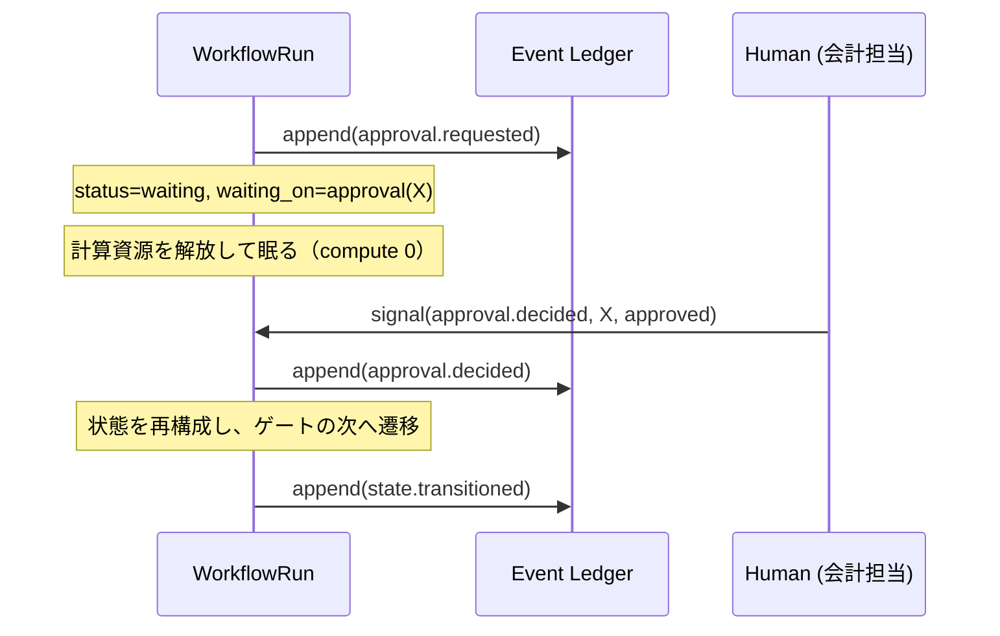
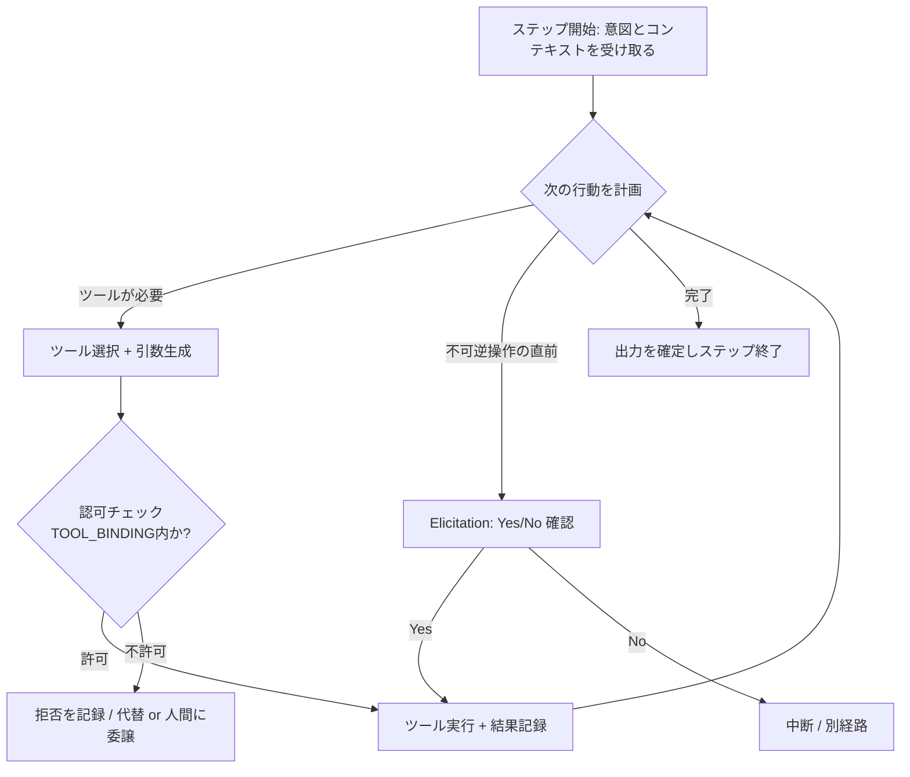
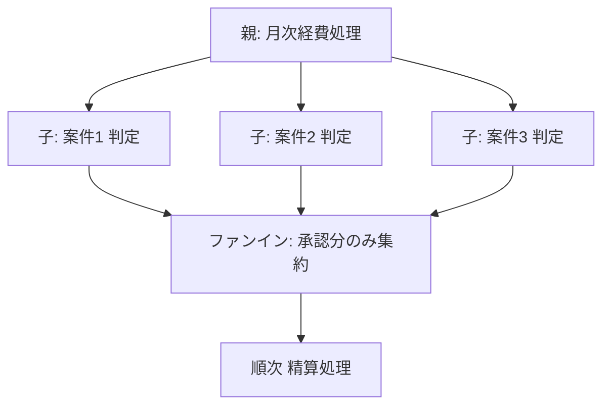

# 03. ワークフロー実行モデル

> **English summary**: How tasks progress. Each task is driven by a **state machine**
> whose transitions are recorded as events (event sourcing), enabling **durable
> pause/resume**: a run that hits an approval gate or external wait persists its
> state, consumes no compute, and resumes on a **signal** (approval click, timer,
> external completion). Steps are agent actions, human gates, system actions, or
> sub-workflows. Concepts mirror durable-execution engines (e.g. Temporal-style
> signals/wait-conditions) and graph workflow runtimes (e.g. LangGraph-style DAGs),
> but the design here is engine-agnostic.

## 1. 実行の基本：状態機械 ＋ イベントソーシング

各タスクは**状態機械**を持ちます。状態遷移は黙って起きず、必ず**イベント**として台帳に
追記されます（[02 §8](./02-domain-model.md)）。現在状態は「イベント列の畳み込み」で得られます。

```
現在状態 = fold(初期状態, [event_0, event_1, ..., event_n])
```

これがもたらす性質：

- **再現性**：同じイベント列からは同じ状態が再構成できる。
- **監査性**：状態がどう変わったかを完全に追える。
- **中断耐性**：プロセスが落ちても、イベントから状態を復元して続行できる。

> 補足：これはいわゆる *durable execution*（Temporal 等）の中核思想と同型です。
> 本設計は特定エンジンに依存せず、この**性質**だけを要件として要求します。

## 2. ステップの 4 種別

| 種別 | 何をするか | 主体 | 例 |
|------|-----------|------|----|
| `agent_action` | LLM エージェントがツールを叩いて進める | エージェント | 運賃を照会して金額を算出 |
| `human_gate` | 人間の判断・承認・入力を待つ | 人間 | 会計担当の承認、Yes/No 確認 |
| `system_action` | 純粋な自動処理（外部副作用も含む） | システム | 送金 API の実行、通知送信 |
| `sub_workflow` | 別ワークフローを子として起動 | — | 「精算」内で「支払い」フローを起動 |

エージェント実行と「人間ゲート」を**別種別**に分けることが本設計の肝です。これにより、
自動で進む区間と、人間を待って止まる区間を、定義上はっきり区別できます。

## 3. 中断と再開（Durable Pause / Resume）

長時間プロセスの本質は「**待つ**」ことです。承認待ち・外部完了待ち・期限待ち。

### 仕組み（概念）



要点：

- 待機中の実行は**計算資源を消費しない**。状態はイベント台帳に永続化されている。
- 再開のトリガは**シグナル**：
  - 承認の押下（人間ゲート）
  - 期限・タイマー（例：締め日になったら）
  - 外部システムからの完了通知（Webhook 等）
- 再開時はイベントを畳み込んで状態を復元し、待っていた地点から続行する。

### 「連鎖が一旦止まる」の意味

ビジョン（[00](./00-vision.md)）の「事前申請が承認されると連鎖が一旦止まる」は、
ここで言う **`waiting` 状態での停止**です。承認は得たが、次の人間トリガ（後日の「精算する」
押下）を待って、実行は再び眠ります。タスクは「事前承認済み・精算待ち」という機械可読な
状態で保持されます。

## 4. 遷移とガード（条件つき遷移）

ステップ間の遷移は条件（ガード）を持てます。

```
transition:
  from: step.precheck_amount
  to:   step.ask_pre_approval
  guard: context.amount <= role_limit(actor) AND context.amount > 0
```

ガードには次が使える：

- コンテキスト値（金額・領収書有無 等）
- アクターのロール／ケイパビリティ（[05](./05-authz-identity.md)）
- 承認レコードの有無・条件
- 外部ツールの戻り値

**承認ゲートのガードは特別扱い**：その遷移は「対応する `ApprovalRecord(approved)` が存在する」
ことを必須ガードとする（[02 §11](./02-domain-model.md) 不変条件 3）。

## 5. エージェント実行ステップの内部

`agent_action` の中では、LLM がエージェントとして**ツール利用ループ**を回します。



重要な制約：

- ツール呼び出しは**毎回認可チェック**を通る。StepDef の `tool_bindings` とアクターの
  ケイパビリティの**積**の範囲に収まる（[05](./05-authz-identity.md)）。
- **不可逆・金銭的なツール**（送金等）の直前では、原則として人間への確認（Elicitation,
  [07](./07-human-in-the-loop.md)）か、上位の承認ゲートを要求する。
- すべてのツール呼び出しはイベントに `tool.invoked`（＋ `capability_used`）として残る。

## 6. 並列とサブワークフロー

- ひとつの実行が複数の `current_steps` を同時に持てる（並列ステップ）。例：複数案件を
  同時に金額照会。
- `sub_workflow` は子の WorkflowRun を起動し、`triggered_by` リンクで親子を結ぶ。
  子の完了は親へシグナルとして返る。
- 集約処理（経理の「対象案件を全部吸い上げてから判定」）は、サブワークフローの**ファンアウト→
  ファンイン**として表現できる。



## 7. 冪等性・再試行・失敗

- 各 StepRun は `idempotency_key` を持ち、**外部副作用は冪等に**実行する（再送・再開で
  二重送金しない）。送金のような操作はキー必須。
- 失敗は状態（`failed`）として表現され、リトライ方針（即時／指数バックオフ／人間へエスカレート）
  を StepDef に持たせられる。
- 補償（saga 的なロールバック）が必要な不可逆操作は、補償ステップを定義に含める。

## 8. 版固定（バージョニング）

実行インスタンスは開始時のワークフロー定義の**版を固定**します（[02 §11-6](./02-domain-model.md)）。
定義を更新しても、進行中インスタンスの解釈は変わりません。これにより、

- 進行中の案件が途中で意味を変えられて壊れることを防ぐ。
- 「この案件は v3 の定義で処理された」と監査で言える。

## 9. グラフ表現との関係

ステップと遷移は実質的に**有向グラフ**（多くは DAG ＋ 承認による待機）です。業界では
LLM ワークフローを DAG として表す runtime（LangGraph 等）や、durable execution エンジン
（Temporal 等）が一般化しています（[09](./09-research-notes.md)）。本設計はそれらの
**概念**（ノード＝ステップ、エッジ＝遷移、シグナルによる待機、状態の永続化）を借りつつ、
特定実装には縛られません。

## 10. このモデルが課題をどう解くか（まとめ）

| 課題（[00](./00-vision.md)） | この実行モデルでの解 |
|------|------|
| B: 状態が会話に溶ける | 状態機械＋イベント台帳が機械可読な正本を持つ |
| A: 第三者の巻き込み | `human_gate` が会話と独立した承認点を作る |
| 中断・再開 | durable pause/resume（§3） |
| 二重実行の危険 | 冪等キー＋版固定（§7, §8） |
| 権限差 | ツール呼び出しごとの認可チェック（§5、[05](./05-authz-identity.md)） |
