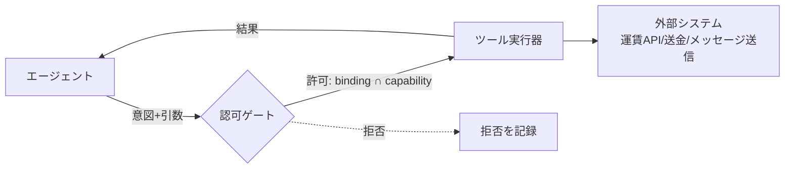

# 04. 外部ツール統合

> **English summary**: How agents reach the outside world. Tools are first-class,
> catalogued entities with typed I/O schemas, a **side-effect class** (read-only /
> reversible-write / irreversible-or-monetary), idempotency requirements, and the
> **scope dimensions** they accept (e.g. amount cap, target set). Agents invoke
> tools only within a step's **tool bindings** ∩ the actor's **capabilities**.
> The integration surface aligns with the Model Context Protocol (MCP) — servers as
> OAuth resource servers, elicitation for confirmations — but the catalog model is
> protocol-agnostic so non-MCP tools fit too.

## 1. ツールとは何か

ツールは、エージェントが外界に作用するための**第一級の登録物**です。チャットの「関数呼び出し」
を組織運用に耐える形に拡張したもので、単なる関数シグネチャ以上の**運用メタデータ**を持ちます。



## 2. ツール定義（Tool Definition）

| フィールド | 意味 |
|-----------|------|
| `key` | ツールキー（例：`fare.lookup`, `payment.execute`, `message.send`） |
| `display_name` / `description` | 人間・LLM 向け説明 |
| `input_schema` / `output_schema` | 入出力の構造化スキーマ |
| `side_effect_class` | 副作用クラス（§3） |
| `idempotency` | 冪等性の要否と鍵の作り方 |
| `scope_dimensions` | 受け付けるスコープ軸（§4） |
| `required_capability` | 呼び出しに必要なケイパビリティ種別 |
| `risk_notes` | 運用上の注意（監査・法令・上限 等） |
| `provider_binding` | 実体への接続（MCP サーバ / 内製 API / SaaS。技術選定は後段） |

**設計判断：ツールは「能力」と「実体」を分けて記述する。** `key` と `scope_dimensions` は
抽象的な能力契約、`provider_binding` が具体的な接続。これにより、同じ能力を別実装に
差し替えても、認可とフローの定義は不変。

## 3. 副作用クラス（Side-effect Class）— 最重要メタデータ

ツールの危険度を 3 段階で分類し、**確認・承認の要否**を決める一次情報にします。

| クラス | 説明 | 既定の人間関与 |
|--------|------|---------------|
| `read_only` | 読み取りのみ。状態を変えない | 不要（自由に実行可） |
| `reversible_write` | 書き込むが取り消せる | 文脈により確認 |
| `irreversible_or_monetary` | 不可逆・金銭・対外送信 | **原則として確認(Elicitation)か承認ゲート必須** |

例：

- `fare.lookup` → `read_only`（運賃を調べるだけ）
- `draft.update` → `reversible_write`（下書きの更新）
- `payment.execute`, `message.send`（対外送信） → `irreversible_or_monetary`

この分類が、[03 §5](./03-workflow-engine.md) の「不可逆操作の直前は Yes/No 確認」や、
[07](./07-human-in-the-loop.md) の確認 UX、[05](./05-authz-identity.md) の権限設計を駆動します。

## 4. スコープ軸（Scope Dimensions）

ツールは「叩けるか／叩けないか」の二値ではなく、**どの範囲まで叩けるか**を持ちます。
これが「実行者ごとに叩ける範囲が違う」（ビジョンの課題 D）の核です。

| スコープ軸 | 例 |
|-----------|----|
| 金額上限 | `payment.execute` は 1 回 20,000 円まで |
| 対象集合 | `message.send` は「登録済み取引先」のみ宛先可 |
| 通貨・勘定 | 特定の勘定科目・通貨に限定 |
| 時間帯・頻度 | レート制限、営業時間内のみ |
| データ範囲 | 自部署の案件のみ参照可 |

スコープは**ツール定義が受け付ける軸**を宣言し、**ケイパビリティが具体値を埋める**
（[05](./05-authz-identity.md)）。例：ツール `payment.execute` は `{amount_cap, account}` を
受け、ある会計担当ロールのケイパビリティが `{amount_cap: 20000, account: "circle-main"}` を与える。

## 5. ツールカタログ（Tool Catalog）

利用可能なツールの登録簿。新しい外部連携を増やす ＝ カタログにツールを足す、という運用にする。

- **登録**：`key`・スキーマ・副作用クラス・スコープ軸・接続先を登録。
- **発見**：ワークフロー定義やエージェントは、カタログから能力を**発見**して `tool_bindings` を組む。
- **版管理**：ツールにも版を持たせ、実行インスタンスは版固定（[03 §8](./03-workflow-engine.md)）。

> 業界の「エージェントが能力を発見して使う」潮流（MCP のツール公開、A2A の Agent Card に
> よる能力広告 等、[09](./09-research-notes.md)）と整合する。ただしカタログは**プロトコル非依存**
> に保ち、MCP ツールも内製 API も SaaS も同じカタログに載る抽象を採る。

## 6. 認可ゲート：binding ∩ capability

エージェントがツールを叩く瞬間、**二重の絞り込み**を通します。

```
実際に許可される範囲 =
    StepDef.tool_bindings[tool]     // このステップで許された範囲（フロー設計者が決める）
  ∩ Actor.capabilities[tool]        // この実行者が持つ範囲（権限管理が決める）
```

- どちらか一方でも許可していなければ拒否。
- スコープ軸は**より狭い方**を採る（金額上限はフロー 50,000・実行者 20,000 なら 20,000）。
- 拒否時は `tool.denied` イベントを残し、エージェントは代替経路か人間への委譲を選ぶ。

この「ステップが許す範囲」と「人が持つ範囲」の積を取る考え方が、フロー設計（実行平面）と
権限管理（認可平面）を**疎結合**にしつつ安全を保つ要。

## 7. MCP との接続（具体例としての一プロトコル）

Model Context Protocol（MCP）は、ツール／リソースを LLM に公開する事実上の標準になりつつあり、
本設計の `provider_binding` の有力な実体の一つです（[09](./09-research-notes.md)）。

- **MCP サーバ＝ OAuth リソースサーバ**：MCP サーバはトークンを検証する資源側に徹し、
  認可サーバは別に置く（2025 年版仕様）。本設計の「ツール実体は認可を外部に委ねる」と一致。
- **Protected Resource Metadata / Resource Indicators**：トークンを「このツール用」に絞って
  発行できる（RFC 9728 / RFC 8707）。本設計のスコープ最小化と整合。
- **Elicitation**：MCP サーバが利用者に Yes/No など追加入力を求める仕組み。本設計の
  「不可逆操作の直前確認」（[07](./07-human-in-the-loop.md)）の実体になりうる。

ただし**技術非依存の原則**から、MCP は「採用しうる接続方式の一例」として扱い、設計の
コア（カタログ・副作用クラス・スコープ・認可ゲート）は MCP 抜きでも成立させる。

## 8. ツール呼び出しの監査

すべての呼び出しは台帳（[02 §8](./02-domain-model.md)）に残る：

```
tool.invoked {
  tool: "payment.execute",
  actor: agent:acc-bot (delegated_from human:tanaka),
  capability_used: "payment.execute@{amount_cap:20000, account:circle-main}",
  args: { amount: 1280, ... },
  idempotency_key: "...",
  result: "ok",
  at: ...
}
```

これにより「誰が・どの権限で・どのツールを・どのタスクの・どのステップで」叩いたかが
完全に追跡可能（監査証跡）。

## 9. 未決事項

- ツール入出力スキーマの記述手段（[02 §12](./02-domain-model.md) の `context_schema` と統一するか）。
- MCP を第一実装として前提に置くか、抽象カタログを先に固めるか。
- スコープ軸の標準セット（金額・対象・時間…）の確定。

→ [10-open-questions.md](./10-open-questions.md)
