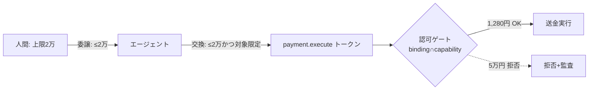
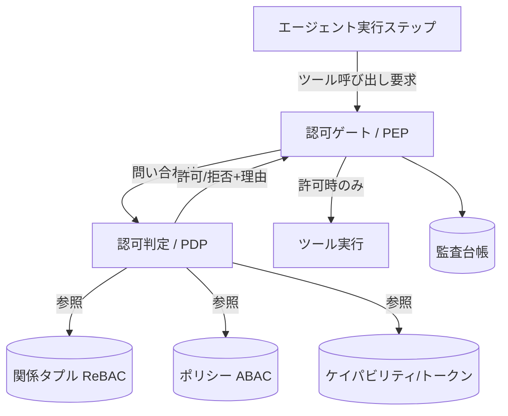

# 05. 認証・認可・権限管理

> **English summary**: The authorization plane. Humans authenticate via OIDC; agents
> are **non-human identities** that act under **delegation** from a human, where each
> delegation **attenuates** (strictly narrows) privileges. Coarse **roles** bundle
> permissions; fine-grained checks use **ReBAC/ABAC** (Zanzibar/OpenFGA-style
> relationship tuples, Cedar-style policies). Tool calls are gated by **capabilities**
> — unforgeable, scoped, short-lived grants (capability/macaroon-style attenuation).
> Cross-service access uses OAuth2.1 + **token exchange (RFC 8693, act/may_act)** and
> emerging **Identity Assertion Grant / Cross-App Access (XAA)**. This is an actively
> standardizing area (OpenID Foundation AIIMCG whitepaper, 2025); see
> [09-research-notes.md](./09-research-notes.md).

> ⚠️ **重要な前提**：AI エージェントのアイデンティティ／認可は 2025〜2026 時点で**標準化の
> 途上**にあります。本ドキュメントは「確定仕様」ではなく、コミュニティの方向性に沿った
> **設計指針**を述べます。一次情報は [09](./09-research-notes.md)。

## 1. なぜ難しいのか（問題の構造）

チャットでは「ログインした人＝操作する人」でした。エージェント基盤では行為者が増えます。

```
人間(依頼者) ──委譲──> エージェント ──ツール──> 外部システム
                          │
                          ├─ サブエージェント ──> 別ツール
                          └─ 別フロー ──> ...
```

すると次が必要になります：

1. **人間の認証**：誰が依頼・承認したのか。
2. **エージェントのアイデンティティ**：どのエージェントが動いたのか（非人間アイデンティティ）。
3. **委譲の表現**：エージェントは「誰の代わりに」「どこまで」動いてよいのか。
4. **多段委譲での権限縮小**：エージェントが別エージェント／ツールを呼ぶたびに権限が
   増えない保証（attenuation）。
5. **細粒度の認可**：ロールだけでなく「この案件のこの操作」まで判定。
6. **監査**：人間→エージェント→ツールの連鎖を後から追える。

OAuth 2.0 は「1 ホップの委譲」は得意ですが、**多段の連鎖**・**非同期/クロスドメイン**・
**スコープと能力の対応づけ**には未整備な部分があり、まさにここが標準化の焦点です
（OpenID Foundation のエージェント AI 向けアイデンティティ白書, 2025）。

## 2. アイデンティティ層

### 2.1 人間：OIDC

人間アクターは **OpenID Connect (OIDC)** で認証する。`sub` を `Actor.identity_ref` に対応づける。
OAuth 2.1（2025 年の統合版、公開クライアントに PKCE 必須・暗黙フロー廃止）を基線とする。

### 2.2 エージェント：非人間アイデンティティ（NHI）

エージェントは**それ自身の検証可能なアイデンティティ**を持つべき（静的 API キーの使い回しは禁忌）。
コミュニティでは次の方向性が議論されている（[09](./09-research-notes.md)）：

- **ワークロード ID（SPIFFE/SPIRE）**：短命・自動ローテーションの検証可能 ID（SVID）を
  エージェントに付与し、それを足場にスコープつきトークンへ交換する（"SVID → scoped token"）。
- **エージェントを IAM の一級主体として扱う**（OpenID Foundation の提言）：ライフサイクル
  （発行・失効）・認証・認可・ガバナンスを人間と並んで管理する。

本設計では `Actor.kind = agent` を一級に持ち、`identity_ref` に NHI を、`delegated_from` に
委譲元の人間を保持する（[02 §10](./02-domain-model.md)）。

## 3. 委譲と縮小（Delegation & Attenuation）— 設計の背骨

**原則：すべての委譲は権限を真に狭める（attenuation）。各ホップで権限は増えない。**

- 人間 → エージェント：人間の権限の**部分集合**だけをエージェントに渡す。
- エージェント → サブエージェント／ツール：さらに狭める。
- 「2 万円まで承認できる人」が委譲したエージェントは、**2 万円を超える操作を絶対にできない**。

### 3.1 標準的な担保手段

| 手段 | 役割 | 参照 |
|------|------|------|
| OAuth Token Exchange (RFC 8693) | あるトークンを別の、より狭いトークンに交換（On-Behalf-Of）。`subject_token`（誰の代わり）と `actor_token`（誰が代行）を区別し、`act` 入れ子クレームで連鎖を表現 | [09](./09-research-notes.md) |
| `may_act` クレーム | 「このトークンは誰が交換してよいか」を事前認可 | RFC 8693 |
| ケイパビリティ / マカロン | トークン自体に**caveat（制約）を付けて縮小**。各ホップで caveat 追記、HMAC 連鎖で完全性、検査可能 | §5 |
| Resource Indicators (RFC 8707) | トークンを「このツール／資源用」に限定発行 | [04 §7](./04-tool-integration.md) |

### 3.2 連鎖は「記録」だけでなく「強制」する

注意点：RFC 8693 の `act` 入れ子クレームは**連鎖の足跡（情報）**であって、それ自体は
強制力を持たない。本設計では、連鎖の各段で**認可ゲート（[04 §6](./04-tool-integration.md)）が
実際にスコープの積を取って強制**することで、「記録された縮小」を「強制された縮小」にする。



## 4. 認可モデル：ロール × ReBAC × ABAC

権限判定は単一モデルでは足りない。3 つを組み合わせる。

### 4.1 ロール（RBAC）— 粗い束ね

人間に「会計担当」「承認者」「依頼者」などのロールを与える。フロー定義の `required_role`
（[02 §5](./02-domain-model.md)）と対応。粗いが運用が分かりやすい。

### 4.2 関係ベース（ReBAC）— 細かい「この案件」判定

「**この案件**の承認者か」「**自部署**の経費か」のような、**主体と対象の関係**に依存する判定は
ReBAC が適する。Google Zanzibar 由来、OpenFGA 等で実装される
`(object, relation, user)` タプルのモデル（[09](./09-research-notes.md)）。

```
(task:expense-0612, approver, role:accounting)
(task:expense-0612, owner,    user:tanaka)
(circle:main,       member,   user:tanaka)
```

判定例：「この承認ゲートを越えてよいか？」＝「actor は当該 task に approver 関係を持つか？」

### 4.3 属性ベース（ABAC / ポリシー）— 条件式

金額・時間帯・副作用クラスなどの**属性条件**は ABAC／ポリシー言語（Cedar 等）で書く。
「金額 ≤ ケイパビリティ上限 かつ 副作用クラス ≤ 許容」のような式。

> 実務では ReBAC（関係）＋ ABAC（条件）を併用するのが一般的（Auth0/OpenFGA・Cedar の知見、
> [09](./09-research-notes.md)）。本設計も両者を組み合わせる前提で、認可判定を**外部化可能**
> （ポリシーエンジンに委ねられる）な境界として設計する。

## 5. ケイパビリティ：ツール呼び出しの実弾

最終的にツールを叩く瞬間の許可は**ケイパビリティ**で表す。

- **偽造不能・検証可能**：所持＝許可。スコープを内包する。
- **スコープ内包**：`payment.execute@{amount_cap:20000, account:circle-main}` のように、
  ツール × スコープ値を束ねる。
- **縮小可能（attenuation）**：マカロン的に caveat を足して狭めて再委譲できる。広げられない。
- **短命**：時間境界つき。失効は連鎖を通じて伝播する設計を志向。

ケイパビリティは [04 §6](./04-tool-integration.md) の `Actor.capabilities[tool]` の実体であり、
認可ゲートが `tool_bindings ∩ capability` を計算する材料になる。

## 6. クロスサービス／クロスアプリのアクセス

ツールが別の SaaS／別アプリの API を叩く場合、エージェントに各サービスの資格情報を
ばらまくのは危険。コミュニティの新しい解：

- **Identity Assertion JWT Authorization Grant / Cross-App Access (XAA)**（IETF OAuth WG の
  Internet-Draft, 2026）：企業 IdP が ID トークン（OIDC）を仲介し、ユーザーの手動同意を
  トークン交換に置き換えて、アプリ間・エージェント↔アプリ間の接続を IdP が統制する。
  トークンには**人間ユーザーとエージェントの両方の文脈**を載せ、監査証跡を保つ。
- これは本設計の「委譲＋縮小＋監査」を、組織境界を越えて成立させるための有力路線
  （[09](./09-research-notes.md)）。

## 7. 認可判定の置き場所（アーキテクチャ境界）

技術非依存を保つため、本設計は**認可を差し替え可能な境界**として定義する：



- **PEP（実施点）**＝認可ゲート：ツール呼び出しを必ず通す関所。[04 §6](./04-tool-integration.md)。
- **PDP（判定点）**：ロール／ReBAC／ABAC／ケイパビリティを総合して許可・拒否を返す。
  外部の認可エンジン（OpenFGA / Cedar 等）に委ねられる境界として保つ。
- 判定結果は理由つきで**台帳に記録**（監査）。

## 8. 監査とガバナンス

- すべての認可判定（許可・拒否）と行使ケイパビリティを台帳に残す（[02 §8](./02-domain-model.md)）。
- エージェントのライフサイクル（発行・権限付与・失効）を人間と同様に管理する。
- 規制動向（例：短命トークンの要求、明示認可なきエージェント間権限委譲の禁止）に追従できる
  よう、「委譲は常に明示・縮小・短命・監査可能」を不変条件として固定する。

## 9. 設計原則（この章の要約）

1. **人は OIDC、エージェントは非人間アイデンティティ**。静的キーの使い回しはしない。
2. **委譲は常に縮小（attenuation）**。各ホップで権限は増えない。
3. **記録だけでなく強制**：連鎖の各段で認可ゲートがスコープの積を取る。
4. **粗（ロール）＋細（ReBAC/ABAC）＋実弾（ケイパビリティ）**の三段で判定。
5. **認可は差し替え可能な境界**（PEP/PDP 分離）として外部化できる。
6. **すべて監査可能**。誰が・どの権限で・何をしたかが台帳に残る。
7. **標準に追従**：OAuth2.1 / Token Exchange / Resource Indicators / XAA 等の成熟を取り込む。

## 10. 未決事項

- 認可エンジンを内製するか、外部（OpenFGA / Cedar 等）に委ねるか（技術選定は後段）。
- ケイパビリティをトークン内包（マカロン的）にするか、中央 PDP 問い合わせ型にするか。
- エージェント NHI を SPIFFE 路線にするか、IdP 発行の NHI にするか。

→ [10-open-questions.md](./10-open-questions.md)
