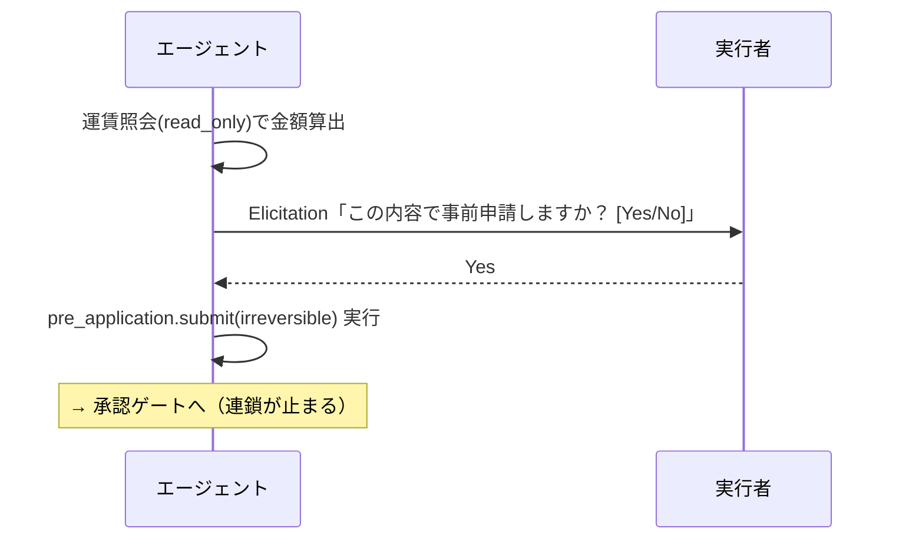

# 07. 人間の承認・介入（Human-in-the-loop）

> **English summary**: Two distinct human-interaction shapes. (1) **Elicitation** —
> a synchronous in-step confirmation to the *executor* before an irreversible action
> ("post the pre-application? Yes/No"), aligned with MCP elicitation. (2) **Approval
> gate** — an asynchronous, structured decision by *another* actor that pauses and
> later resumes the task chain (durable wait + signal). Defines when each is used,
> the minimal-context approval surface, escalation/timeout, and re-application.

## 1. 二種類の「人間の関与」を区別する

混同されがちだが本質的に別物。設計上はっきり分ける（[01](./01-glossary.md) の用語整理）。

| | 確認 / Elicitation | 承認ゲート / Approval Gate |
|---|---|---|
| 誰が | **実行者本人** | **別のアクター**（会計担当・承認者） |
| いつ | 操作の**直前**（同期的） | フローの**節目**（非同期・待機を伴う） |
| 何を | 「この操作をして良いか」の最終 Go/No-Go | 「この申請を認めるか」の意思決定 |
| 結果 | その場で続行/中断 | ApprovalRecord 生成＋連鎖の停止/再開 |
| 例 | 「事前申請を投稿しますか？ Yes/No」 | 会計担当が事前申請を承認 |
| 実体 | [04 §7](./04-tool-integration.md) MCP Elicitation 等 | [03 §3](./03-workflow-engine.md) durable wait + signal |

## 2. 確認（Elicitation）

エージェント実行ステップ（[03 §5](./03-workflow-engine.md)）の中で、**不可逆・金銭的操作**
（[04 §3](./04-tool-integration.md) の `irreversible_or_monetary`）に踏み込む直前、実行者へ
Yes/No（または少量の追加入力）を問う。

- ビジョンの「金額は妥当と判断 → これで事前進出しますか？ → Yes で事前申請が投稿される」が典型。
- **同期的**：その場で答えが返り、ステップが続行/中断する（長期の待機ではない）。
- 設計指針：read_only は確認不要、reversible_write は文脈次第、irreversible は原則確認。
- 業界対応：MCP の **Elicitation**（2025 年仕様で導入。「本当に削除しますか？」型の確認や、
  追加情報の収集に使う。No/キャンセルを必ず提供）と概念が一致（[09](./09-research-notes.md)）。



## 3. 承認ゲート（Approval Gate）

**別のアクター**による構造化された意思決定。フローを**中断**し、決定で**再開**する
（[03 §3](./03-workflow-engine.md) の durable pause/resume）。

### 3.1 最小文脈の承認面（課題 A の解消）

承認者は長い会話を読まない。承認面に出すのは構造化された最小情報のみ：

```
┌─ 承認依頼 #expense-0612 ─────────────┐
│ 種別 : 交通費 事前申請                │
│ 申請者: 田中                          │
│ 内容 : ○○駅 → △△駅                  │
│ 金額 : ¥1,280（運賃照会の根拠つき）   │
│ 規定 : 領収書不要・上限内             │
│   [ 承認 ]  [ 却下 ]  [ 要修正 ]      │
└──────────────────────────────────────┘
```

- 承認者は自分の UI（一覧・通知）から、文脈を引きずらずに 1 件として処理できる。
- 決定は **ApprovalRecord**（[02 §7](./02-domain-model.md)）として残り、会話の発言には混ざらない。

### 3.2 中断と再開の保証

- 承認待ちの間、実行は資源を消費せず眠る（[03 §3](./03-workflow-engine.md)）。
- 承認は**耐久的に保存**される：UI やプロセスが落ちても、決定はイベントに残り、再開時に
  「承認済み」として畳み込まれる。
- 承認の押下は**シグナル**として実行へ届き、ゲートの次へ遷移させる。

### 3.3 条件つき承認

「2 万円までなら承認」のような条件は ApprovalRecord の `conditions` に持ち、以後のガード
（[03 §4](./03-workflow-engine.md)）と認可（[05](./05-authz-identity.md)）が参照する。

## 4. エスカレーション・期限・委任

- **タイムアウト**：承認が一定期間来なければ、リマインド／上位へエスカレート／自動却下を
  StepDef に定義できる（タイマーシグナル、[06 §8](./06-recurring-tasks.md)）。
- **代理承認**：承認者の権限を別の人へ**縮小して委譲**できる（[05 §3](./05-authz-identity.md)）。
- **複数承認**：金額帯により「2 名承認」等の合議を、並列の human_gate ＋ファンインで表現
  （[03 §6](./03-workflow-engine.md)）。

## 5. 却下・要修正・再申請

- `rejected`：連鎖を終了またはドラフトへ戻す。
- `changes_requested`：申請者に修正を促し、修正後の再申請は **`supersedes`** リンクで
  旧申請を置換（[02 §4](./02-domain-model.md)）。監査では履歴が連続して見える。

## 6. なぜこの分離が効くか

- **確認**は「実行者が暴走しないための即時ブレーキ」。
- **承認**は「組織が統制を効かせるための構造化された関所」。
- 両者を分けることで、自動で速く進む部分と、人を待って慎重に進む部分を、フロー定義上で
  明確に設計・監査できる。チャットのように「誰かが会話に割り込む」曖昧さを排除する。

## 7. 未決事項

- 確認 UX をどのチャネルで出すか（アプリ内／チャット／モバイル通知）。
- 承認面の標準テンプレート（種別ごとに何を見せるか）。
- 合議・エスカレーションの既定ポリシー。

→ [10-open-questions.md](./10-open-questions.md)
