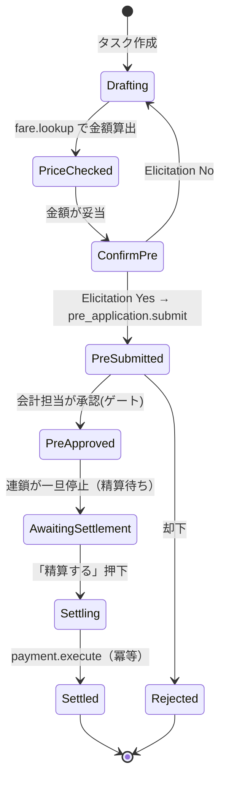
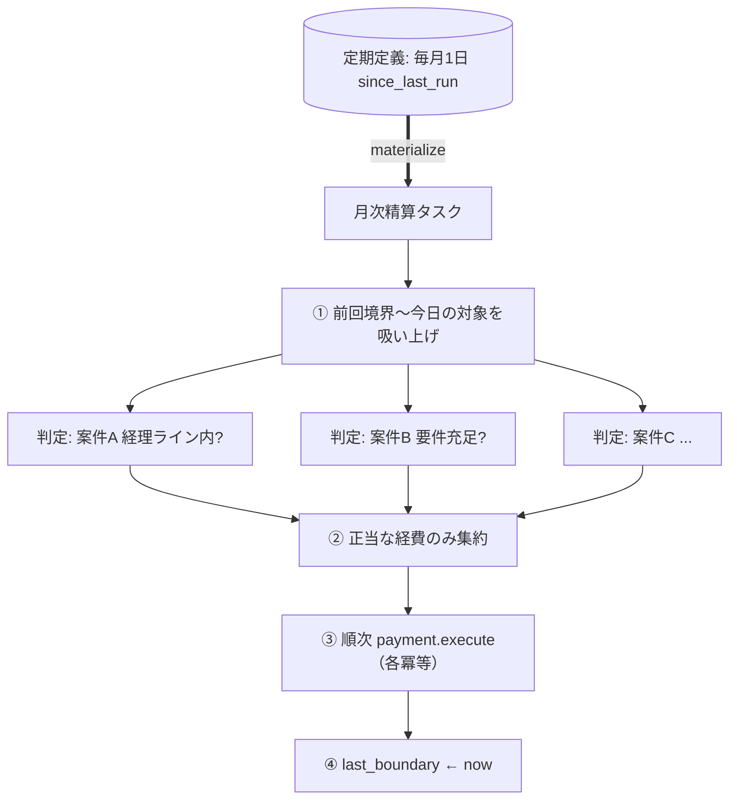

# 08. 具体ワークフロー（リファレンス）

> **English summary**: End-to-end worked examples that exercise every concept.
> Primary: **transport-expense reimbursement** — create task → agent looks up fare
> (read-only) → elicitation Yes/No → pre-application posted → accounting **approval
> gate** (chain pauses) → later "settle" → idempotent payout. Also: monthly batch
> settlement (interval processing) and an external-contact task, showing the model
> generalizes beyond accounting.

これまでの抽象（[02](./02-domain-model.md)〜[07](./07-human-in-the-loop.md)）を、具体例で
通しで確認します。これは設計の**検証**であり、概念の抜けを洗い出す目的も持ちます。

## 1. 交通費の精算（主たる例）

> ⚠️ **現実の Jomon との対応（重要）**：以下は**抽象モデル**。実際の経費は traP の **Jomon**
> （部費＝部の公式予算専用）に載る。Jomon は単一 Application を
> `pending_review→approved→payment_finished` と進める**単段階**で、本例の「事前申請」と「精算」が
> 別エンティティに分かれているわけではない（[12 §A-0](./12-cross-service-usecases.md) を精読）。
> よって `pre_application.submit` / `payment.execute` は、Jomon 上では
> **(a) 2 つの Application をリンク** するか **(b) 1 Application のライフサイクル** に寄せるか、の
> 設計判断（[10](./10-open-questions.md) J1）になる。また**部費外のお金（合宿参加費等）は Jomon の
> 対象外**で、この例は「部費で賄う交通費」に限る。

### 1.1 登場物

| 種類 | 値 |
|------|----|
| TaskType | `expense.transport` |
| context_schema | `{ route_from, route_to, amount, currency, receipt_required, pre_approval_id, settled }` |
| アクター | 依頼者=田中、担当エージェント=`acc-bot`（田中から委譲）、承認者=会計担当 |
| ツール | `fare.lookup`(read_only), `pre_application.submit`(irreversible), `payment.execute`(irreversible_or_monetary) |

### 1.2 状態機械

### 1.3 ステップ別の動き（平面の対応つき）

| 段階 | ステップ種別 | 何が起きるか | どの平面 |
|------|------------|------------|---------|
| ① 起票 | — | 田中が「○○→△△の交通費を申請したい」とタスク作成 | 作業 |
| ② 金額照会 | `agent_action` | `acc-bot` が `fare.lookup`(read_only) を呼び ¥1,280 を算出 | 実行＋認可 |
| ③ 妥当性 | 遷移ガード | `amount > 0 かつ 規定内` を確認 | 実行 |
| ④ 確認 | Elicitation | 「この内容で事前申請しますか？ [Yes/No]」 | HITL |
| ⑤ 事前申請 | `agent_action` | Yes → `pre_application.submit`(irreversible) を実行 | 実行＋認可 |
| ⑥ 承認待ち | `human_gate` | **連鎖が止まり**、会計担当の承認を待って眠る | 実行(中断) |
| ⑦ 承認 | 承認ゲート | 会計担当が最小文脈の承認面で「承認」→ ApprovalRecord | 作業＋HITL |
| ⑧ 精算待ち | 状態保持 | `AwaitingSettlement`。後日の「精算する」を待つ | 作業 |
| ⑨ 精算 | `human_gate`→`system_action` | 移動完了後「精算する」押下。交通費は領収書不要規定により `payment.execute`(冪等) | 実行＋認可 |
| ⑩ 完了 | — | `Settled`。全イベントが台帳に残る | 作業 |

### 1.4 この一本が踏むキー概念

- **会話と状態の分離**：⑧で「事前承認済み・精算待ち」という機械可読状態が保持される（[03](./03-workflow-engine.md)）。
- **確認と承認の分離**：④は実行者への同期確認、⑦は他者の非同期承認（[07](./07-human-in-the-loop.md)）。
- **連鎖の停止と再開**：⑥と⑧で durable wait、⑦と⑨の押下が再開シグナル（[03 §3](./03-workflow-engine.md)）。
- **認可ゲート**：②⑤⑨で `tool_bindings ∩ capability`。`acc-bot` は田中から縮小委譲された
  範囲（例：上限内）でのみ送金できる（[05](./05-authz-identity.md)）。
- **冪等な金銭操作**：⑨は冪等キーで二重送金を防ぐ（[04 §3](./04-tool-integration.md)）。
- **監査**：①〜⑩すべてが台帳に残り、誰が・どの権限で・何をしたかを追える（[02 §8](./02-domain-model.md)）。

## 2. 月次バッチ精算（区間処理）

ビジョンの「経路生産：対象案件を全部吸い上げ → 経理ライン判定 → 順次ストライプ処理」。

- 対象期間 = `[last_boundary, now)`（[06 §3](./06-recurring-tasks.md)）。
- 吸い上げ→判定→精算は、サブワークフローのファンアウト→ファンイン（[03 §6](./03-workflow-engine.md)）。
- 各送金は冪等。成功して初めて境界を進める（at-least-once ＋ 冪等 ＝ 実質 exactly-once）。

## 3. 外部連絡タスク（経理以外への一般化）

「外部の取引先に連絡を取りたい」を同じ骨格で表す。経理に限らないことの確認。

| 段階 | 種別 | 動き |
|------|------|------|
| 起票 | — | 「取引先 X に納期確認の連絡をしたい」 |
| 下書き | `agent_action` | エージェントが文面を `draft.update`(reversible_write) で作成 |
| 確認 | Elicitation | 「この文面で送信しますか？ [Yes/No]」 |
| （必要なら）承認 | `human_gate` | 対外送信が要承認の組織なら、責任者の承認ゲート |
| 送信 | `system_action` | `message.send`(irreversible_or_monetary=対外送信) を冪等実行 |
| 追跡 | 状態保持 | 返信待ちで眠り、返信 Webhook をシグナルに再開 |

→ 同じ「タスク＋ワークフロー＋ツール＋確認/承認＋認可」で、業務ドメインを問わず表現できる。

## 4. この章から得た設計フィードバック

通しで書くことで見えた、モデルへの含意（[10](./10-open-questions.md) に反映）：

1. **「精算する」押下は人間ゲートだが承認ではない**：実行者本人のトリガ。human_gate の中に
   「承認（他者）」と「実行トリガ（本人）」の 2 サブ種別が要るかもしれない。
2. **規定（領収書要否など）はどこに置くか**：TaskType か、組織ポリシー（ABAC）か。
   横断ルールなのでポリシー側が自然か（[05 §4.3](./05-authz-identity.md)）。
3. **「経理ラインを越えているか」の判定**は ABAC 条件として外部化できる（[05](./05-authz-identity.md)）。
4. **対外送信の副作用クラス**は金銭ではないが不可逆。`irreversible` を金銭と非金銭で
   細分する余地（[04 §3](./04-tool-integration.md)）。
