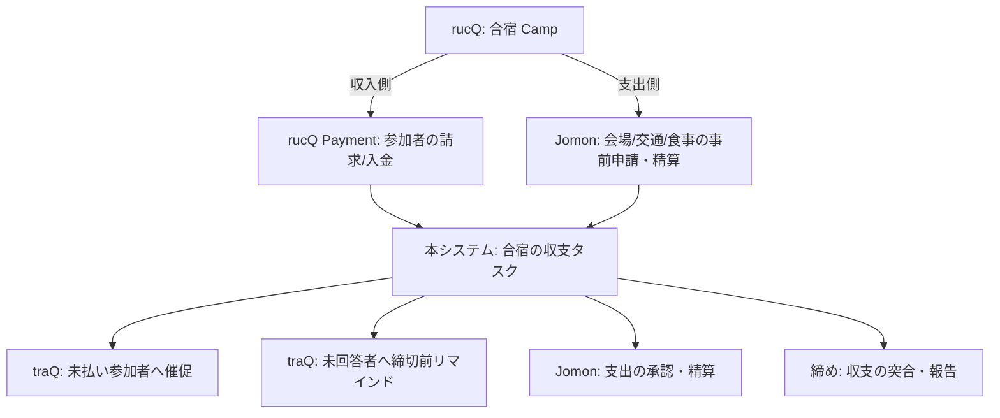
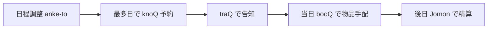
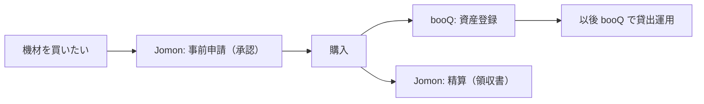

# 12. サービス別ユースケースと横断連携

> **English summary**: Explores the *use-case* surface across the whole traP service
> catalog and — crucially — **cross-service composite workflows**, which is where an
> agent orchestration layer adds value no single existing service provides.
> Part A: per-service tasks/tools (knoQ, booQ, anke-to, NeoShowcase, rucQ,
> trap-collection, traPortfolio, traPortal, Qall) with side-effect classes.
> Part B: cross-service links where the orchestration layer genuinely adds value.
> **Correction (v2):** rucQ is NOT a thin hub to be assembled from anke-to/knoQ/Jomon —
> it is a near-complete camp-ops system of its own (registration, deadline-bound
> pre-questions, payment/collection, rooming, roll-calls, schedule, guidebook). So the
> real value is connecting rucQ's *income* side to Jomon's *expense* side and adding
> proactive chasing/approval — not rebuilding it. Other genuine composites: event→expense,
> equipment purchase lifecycle. Part C: not-yet-captured
> cross-cutting use cases (deadlines/reminders, onboarding, role handover, audits).
> Part D: design implications (cross-service task links, unified catalog, traQ-scoped
> access). This doc widens [04] and [08] beyond the accounting anchor.

このドキュメントは、[11](./11-trap-ecosystem.md) で把握した traP サービス群について、
「**どんなタスクが載るか**」「**サービスをまたいで何ができるか**」「**まだ拾えていない用途**」を
広く掘ります。設計の中心命題——*単一サービスでは完結しない仕事をエージェントが連鎖でつなぐ*
——を具体例で裏づけるのが狙いです。

## traP サービス全体マップ（接地の確定版）

| サービス | 何をするか | 本システムでの主な役割 |
|---------|-----------|----------------------|
| **traQ** | チャット＋OAuth2 認可サーバー＋BOT＋スタンプ＋**Qall**(通話, LiveKit) | 認証・対話・通知・承認の場（[11](./11-trap-ecosystem.md)） |
| **traPortal** | 部員情報管理・招待コード | 認可平面（ロール・在籍）の参照元 |
| **knoQ** | 進捗部屋・イベント・部屋予約（iCal） | ツール：予約・空き照会 |
| **Jomon** | 会計支援（申請→承認→取引・領収書） | ツール：経費・支払い（[08](./08-reference-workflows.md)） |
| **anke-to** | 部内アンケート・投票 | ツール：意思決定・日程調整の入力 |
| **booQ** | 備品・書籍の貸出管理（返却期限・カレンダー） | ツール：在庫照会・貸出・返却 |
| **NeoShowcase** | 内製 PaaS（500+ アプリ、自動ビルド/デプロイ） | ツール：デプロイ・状態照会 |
| **traPortfolio** | 部員の活動ポートフォリオ | ツール：活動・実績の参照（主に read_only） |
| **rucQ** | **合宿運営システム**（登録・締切つき事前質問・集金・部屋割り・点呼・しおり・スケジュールを内製） | ほぼ自己完結。本システムは外側の催促・承認・対 Jomon 連携を担う（B-1） |
| **trap-collection** | 内製ゲームの管理・配布 | ツール：作品登録・公開 |

---

# Part A. サービス別ユースケースとツール化

各サービスを [04](./04-tool-integration.md) のツール（副作用クラス付き）として捉え、
そこに載るタスク・承認・定期パターンを洗い出す。

> ⚠️ **確度について**：rucQ（[A-5](#a-5-rucq合宿運営)）は `openapi.yaml` ＋ `model/*.go` を
> 実際に読んで記述しており確度が高い。一方、他サービス（knoQ・booQ・anke-to・NeoShowcase 等）の
> 機能記述は紹介記事・README 等の軽い情報に基づく**暫定**で、rucQ で起きたような取り違えの
> 可能性がある。MVP 前に各サービスの OpenAPI を rucQ 同様に精読して確定する（[10 U2](./10-open-questions.md)）。

## A-1. knoQ（部屋・イベント予約）

| ツール例 | 副作用クラス |
|---------|-------------|
| `knoq.room.availability`（空き照会） | read_only |
| `knoq.event.create` / `knoq.room.reserve` | reversible_write |
| `knoq.event.cancel` | reversible_write |

- **単発**：「来週水曜の進捗部屋を取りたい」→ 空き照会 → 予約 → traQ で関係者に通知。
- **定期**（[06](./06-recurring-tasks.md)）：「毎週○曜の定例部屋を自動予約」。区間ではなく
  `point_in_time` の繰り返し。重複予約を冪等キーで防ぐ。
- **承認**：大規模イベントや長時間占有は責任者の承認ゲート（[07](./07-human-in-the-loop.md)）。

## A-2. booQ（備品・書籍の貸出）

| ツール例 | 副作用クラス |
|---------|-------------|
| `booq.item.search`（在庫・所在照会） | read_only |
| `booq.loan.request`（貸出申請） | reversible_write |
| `booq.loan.return`（返却記録） | reversible_write |
| `booq.item.register`（資産登録） | reversible_write |

- **単発**：「撮影用カメラを借りたい」→ 在庫照会 → 貸出申請 → 返却期限を記録。
- **定期/期限**：返却期限が近づいたら traQ でリマインド（期限シグナル、[06 §8](./06-recurring-tasks.md)）。
- **承認**：高額機材は承認ゲート。
- **連携の芽**：購入した機材を `booq.item.register` で資産化（→ B-3 と接続）。

## A-3. anke-to（アンケート・投票）

| ツール例 | 副作用クラス |
|---------|-------------|
| `anketo.survey.create` | reversible_write |
| `anketo.result.fetch`（集計取得） | read_only |

- **単発**：「新歓の日程調整アンケートを作りたい」→ 作成 → 集計 →（結果を次の行動の入力に）。
- **意思決定トリガ**：投票結果が「最多日に knoQ 予約」などの後続を駆動（→ B-2）。
- **承認の代替/補完**：合議的な可否を投票で取り、ApprovalRecord に反映する設計余地。

## A-4. NeoShowcase（デプロイ／PaaS）

| ツール例 | 副作用クラス |
|---------|-------------|
| `ns.app.status`（ビルド/稼働状態照会） | read_only |
| `ns.app.redeploy` / `ns.app.restart` | irreversible_or_monetary（本番影響）|

- **単発**：「このアプリを再デプロイしたい」→ 状態照会 → 確認 → 再デプロイ。
- **承認**：本番影響のある操作は確認＋承認を必須（[07](./07-human-in-the-loop.md)）。
- **監視連動**：障害検知をシグナルに、エージェントが一次対応タスクを起票（後述 C）。

## A-5. rucQ（合宿運営）

> ⚠️ **訂正メモ**：本ドキュメント初版では rucQ を「anke-to で日程調整 → knoQ で部屋予約 →
> Jomon で集金…を束ねるハブ」と書いたが、**誤り**。実物（`openapi.yaml` ＋ `model/*.go`）を
> 確認すると、rucQ は合宿運営の大半を**自前で内包する完成度の高い専用システム**だった。
> 以下は実機能に基づく正確な記述。

### rucQ が自前で持つドメイン（実機能）

| 概念 | 内容 |
|------|------|
| **Camp** | 合宿本体。`name`・`guidebook`(Markdown のしおり)・開催期間・**ドラフト/登録受付中/支払い受付中フラグ**（＝ライフサイクル） |
| **Registration / Participant** | 参加登録・キャンセル、参加者一覧、スタッフ(`isStaff`)判定 |
| **QuestionGroup / Question / Option / Answer** | **締切(`due`)つきの事前質問**。型は free_text / free_number / single / multiple。`isPublic`/`isOpen`/`isRequired`。回答は本人提出＋管理者代理入力も可 |
| **Payment** | 参加者ごとの `amount`(請求額) と `amountPaid`(入金額)＝**集金の進捗管理** |
| **RoomGroup / Room / RoomStatus** | **部屋割り**。部屋の在室ステータスと履歴(status-logs) |
| **Event** | 合宿中のスケジュール。`duration`(時間幅) / `official`(公式) / `moment`(時点) の3型、場所・主催者付き |
| **RollCall / Reaction** | **点呼**。`subjects`(対象)・`options`(選択肢)を持ち、参加者が reaction で応答。**リアルタイムstream**あり |
| **Activity** | 部屋作成・支払い変更・点呼・質問公開などの活動フィード |
| その他 | 画像(しおり用)、管理者からの traQ DM 送信 |

### つまり：rucQ は「合宿版の本システム」に近い

rucQ は既に「ライフサイクルを持つ案件（Camp）＋締切つき入力収集（Question）＋集金（Payment）＋
割り当て（Room）＋点呼（RollCall）」を備える。本システムの抽象（タスク・状態・期限・集約）と
**構造が酷似**しており、rucQ を作り直す価値は薄い。

### では本システム（エージェント層）が rucQ に足せる価値は何か

rucQ が**データと操作**を持つのに対し、本システムは**能動的な進行と連鎖**を足す：

1. **締切の能動的な催促**（[06](./06-recurring-tasks.md), [12 C-1](#c-1-期限締切リマインドの横断)）：
   Question の `due` 前に未回答者へ traQ 通知、Payment の `amountPaid < amount` の未払い者へ催促。
   rucQ は締切と入金状況を**持つ**が、追いかけは人手。ここをエージェントが担う。
2. **点呼の異常検知**：RollCall の `subjects` と reaction を突き合わせ、未応答者を traQ で呼び出す。
3. **対 Jomon 連携**（B-1）：rucQ の Payment は**参加者からの集金（収入側）**。一方、合宿の
   会場費・交通費・食事業者への支払い（**支出側**）は Jomon を通る。両者を一つの「合宿の収支」
   タスクとして連結するのは rucQ 単体ではできない＝本システムの出番。
4. **ライフサイクルの自動遷移**：ドラフト→登録受付→支払い受付→締め、の節目に承認/通知を挟む。

ツール化の例：

| ツール例 | 副作用クラス |
|---------|-------------|
| `rucq.camp.get` / `rucq.participants.list` / `rucq.payments.list` | read_only |
| `rucq.answers.get`（未回答者の割り出し） | read_only |
| `rucq.user.message`（管理者 DM 送信） | irreversible_or_monetary（対人通知） |
| `rucq.payment.update`（入金記録の更新） | reversible_write |

## A-6. trap-collection（ゲーム管理・配布）

| ツール例 | 副作用クラス |
|---------|-------------|
| `tc.work.register`（作品登録） | reversible_write |
| `tc.work.publish`（公開） | irreversible_or_monetary（対外公開） |

- 「作品を部の展示に登録したい」→ 登録 → 公開は承認ゲート（対外公開＝不可逆）。

## A-7. traPortfolio / traPortal（参照・在籍・ロール）

- **traPortfolio**：活動・実績の参照（read_only）。タスクの文脈補強に使う。
- **traPortal**：在籍・ロールの参照は[05](./05-authz-identity.md) の認可判定の入力。
  入部処理・ロール付与は運用タスク（→ C-2 オンボーディング）。

## A-8. Qall（通話）

- **HITL のエスカレーション先**：テキスト承認が滞る／重要案件は「Qall で相談」を促す。
  承認ゲートのタイムアウト時の代替経路（[07 §4](./07-human-in-the-loop.md)）。

---

# Part B. サービス間連携（複合ワークフロー）— 本システムの核心

既存サービスは個々に完結している。**サービスをまたぐエンドツーエンドの仕事**を、一つの
タスクの連鎖として束ねるのが、このオーケストレーション層の最大の価値。

## B-1. 合宿の「収支」連結（rucQ ⇄ Jomon、traQ で催促）

> 訂正後の正しい連携像。rucQ は合宿運営をほぼ自己完結する（[A-5](#a-5-rucq合宿運営)）ため、
> 「複数サービスで合宿を組み立てる」のではなく、**rucQ が持たない外側＝対外的な収支と催促**を
> 本システムが担う、という細い連携になる。

rucQ の `Payment` は**参加者からの集金（収入）**を追うが、合宿の**支出**（会場費・交通・食事業者
への支払い、立替の精算）は会計システム **Jomon** を通る。両者は別システムで、**合宿1件の収支を
通しで見る手段が現状ない**。ここが本システムの価値。

- 「合宿の収支」を一つのタスクとして、rucQ（収入）と Jomon（支出）を**リンク**で束ねる
  （`external_ref`、[Part D](#part-d-連携を支える設計上の含意)）。rucQ も Jomon も改変しない。
- 催促（未払い・未回答）は rucQ の状態を読み、traQ 通知で能動的に行う（[06 C-1](#c-1-期限締切リマインドの横断)）。
- 支出側の承認・精算は [08](./08-reference-workflows.md) の経費フローをそのまま使う。

> 教訓：**既存サービスが厚いところは「束ねる」のではなく「外側の連鎖と催促」を足す**。
> 薄いところ（サービス間にまたがる収支・期限・承認）こそ本システムの主戦場。
> ([12 全体の前提を A-5 の訂正に合わせて見直したもの。])

## B-2. イベント運営の連鎖（anke-to → knoQ → traQ → Jomon）

- anke-to の集計結果が knoQ 予約の入力になる（**サービスの出力が次の入力**）。
- 「イベント → 物品 → 経費」が一本の連鎖で追跡可能（従来は人手で分断）。

## B-3. 物品購入のライフサイクル（Jomon × booQ）

- 「お金（Jomon）」と「資産（booQ）」を連結。購入した物が貸出可能資産として登録されるまでを
  一連で扱う（[11 §5](./11-trap-ecosystem.md) の Jomon 連携と [A-2](#a-2-booq備品書籍の貸出) が合流）。

## B-4. 作品公開フロー（NeoShowcase × trap-collection × anke-to）

- NeoShowcase でデプロイ → trap-collection で作品登録・公開（承認）→ anke-to で部内評価投票。
- ハッカソン後の「成果を公開して評価を集める」を一本化。

---

# Part C. まだ拾えていない横断ユースケース

個別サービスに紐づかない、**運用・組織レベル**の用途。ここに定期タスク・承認・委譲の価値が効く。

## C-1. 期限・締切リマインドの横断

booQ 返却期限・Jomon 精算期限・イベント申込締切・合宿支払い…を**横断的に**監視し、
期限シグナル（[06 §8](./06-recurring-tasks.md)）で traQ 通知・エスカレーション。
「締切管理」を個別サービス任せにしない。

## C-2. オンボーディング（入部時の一括処理）

「新入部員を迎える」一つのタスクが、traPortal 登録 → traQ 招待 → ロール付与 →
初期チャンネル案内…を順に実行。**人間の確認を要所に挟む**自動化。

## C-3. 役職・権限の引き継ぎ（認可平面の運用タスク）

年度替わりの役職交代を、権限の**委譲・棚卸し**として扱う（[05 §3](./05-authz-identity.md)）。
「会計担当を交代する」＝ Jomon 承認権限の付け替え＋旧権限の失効を、監査可能な形で実行。

## C-4. 棚卸し・監査

年度末の物品棚卸し（booQ）、会計監査（Jomon）を定期タスク化。台帳（[02 §8](./02-domain-model.md)）が
監査証跡を提供。

## C-5. 「相談 → 意思決定 → 実行」の汎用パターン

anke-to 投票や Qall 相談で合意を取り、その結果を実行に移す——という、ドメイン非依存の
意思決定パターン。経理にも、イベントにも、組織運営にも適用できる本システムの素地。

## C-6. 外部対応タスク

スポンサー連絡、大学事務への申請、他団体との調整など、**対外（不可逆送信）**を伴う連絡を
[08 §3](./08-reference-workflows.md) の外部連絡フローで扱う。

---

# Part D. 連携を支える設計上の含意

横断連携を成立させるために、既存ドキュメントへ反映すべき点。

1. **クロスサービス・タスクリンク**（[02 §4](./02-domain-model.md), [11 §9 N4](./11-trap-ecosystem.md)）：
   本システムの「タスク」を、Jomon の申請・knoQ の予約・booQ の貸出など**既存サービスの
   レコードへリンク**できる必要がある。`external_ref`（サービス名＋ID）を持つリンク型を検討。
2. **統一ツールカタログ**（[04 §5](./04-tool-integration.md)）：全サービス API を副作用クラス付きで
   登録。下表が初期分類。
3. **traQ スコープでの横断アクセス**（[05](./05-authz-identity.md), [11 §3](./11-trap-ecosystem.md)）：
   各サービスは traQ OAuth2 で認証済み。エージェントはユーザー委譲の traQ トークンで横断する。
4. **集約は サブワークフロー**（[03 §6](./03-workflow-engine.md)）：合宿集金・月次精算などの
   ファンアウト→ファンインで表現。

## 全サービス 副作用クラス分類（初期案）

| サービス | read_only | reversible_write | irreversible_or_monetary |
|---------|-----------|------------------|--------------------------|
| knoQ | 空き照会 | 予約・取消 | （長期占有は承認で扱う） |
| booQ | 在庫照会 | 貸出・返却・登録 | 高額機材の貸出（承認） |
| anke-to | 集計取得 | アンケート作成 | — |
| Jomon | 残高・申請照会 | 申請下書き | **支払い・精算** |
| NeoShowcase | 状態照会 | 設定変更 | **本番デプロイ・再起動** |
| trap-collection | 作品照会 | 作品登録 | **公開（対外）** |
| traQ | メッセージ取得 | 下書き | **対外送信・送金性メッセージ** |

---

## この探索から生まれた未決事項（[10](./10-open-questions.md) に追記予定）

- **U1**：複合ワークフロー（合宿・イベント）を MVP に含めるか、単一サービス縦串から始めるか。
- **U2**：`external_ref`（外部レコードへのリンク）の表現と、重複・同期の扱い（N4 の具体化）。
- **U3**：anke-to 投票を「承認」とみなせる条件（合議の定足数・期限）。
- **U4**：横断リマインド（C-1）を独立機能にするか、各タスクの期限から自動生成するか。
- **U5**：オンボーディング/役職引き継ぎ（C-2/C-3）を業務テンプレートとして標準提供するか。

## 参考リンク

- SysAd 班（サービス運用）: https://trap.jp/sysad/
- 新入部員向けサービス全解説: https://trap.jp/post/2154/
- knoQ: https://github.com/traPtitech/knoQ ／ booQ: https://github.com/traPtitech/booQ
- anke-to: https://github.com/traPtitech/anke-to ／ NeoShowcase: https://github.com/traPtitech/NeoShowcase
- traPortfolio: https://portfolio.trap.jp/ ／ trap-collection: https://github.com/traPtitech/trap-collection-server
